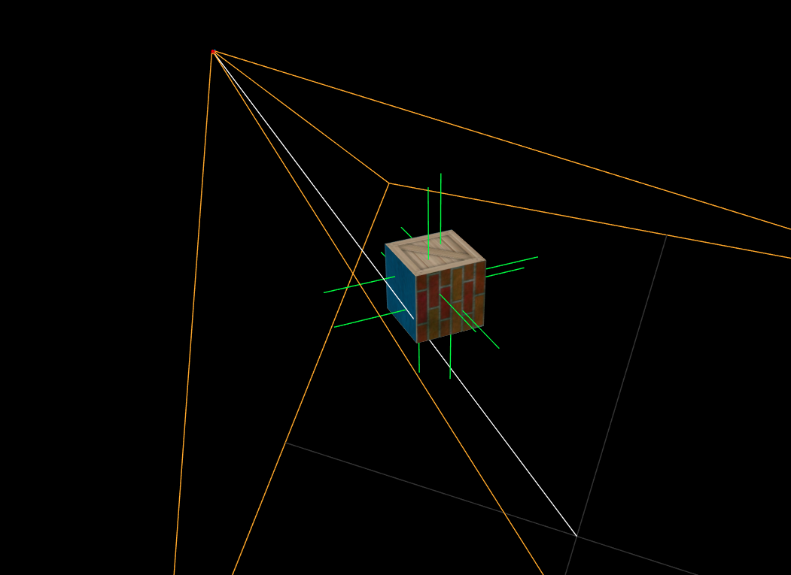
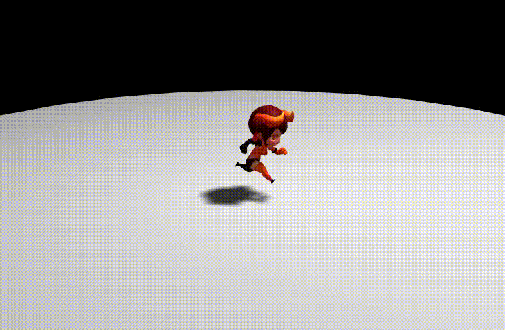
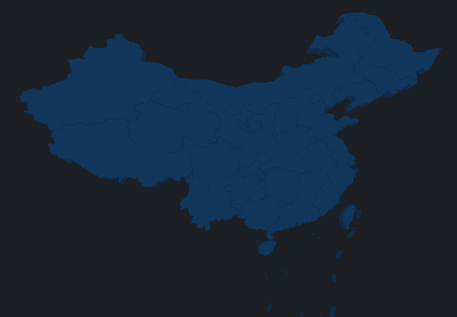

### ThreeJS 示例：

1.  [ThreeJS(1): 初始化 ThreeJS 项目](https://github.com/zhouzhili/webGL-webGIS-Learning/tree/master/webglCodes/city3D)

2. [ThreeJS(2): 阴影和光照](https://github.com/zhouzhili/webGL-webGIS-Learning/tree/master/webglCodes/shadow)

3. [ThreeJS(3): 纹理与材质](https://github.com/zhouzhili/webGL-webGIS-Learning/tree/master/webglCodes/texture)

4. [ThreeJS(4): 外部模型](https://github.com/zhouzhili/webGL-webGIS-Learning/tree/master/webglCodes/LoadGLTF)

6. ThreeJS 加载 GeoJson 并拉升

