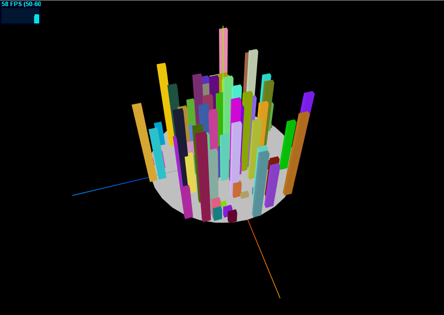

ThreeJS(一)：初始化 ThreeJS 项目

ThreeJS 绘制主要需要三个对象：场景(scene),相机(camera),渲染器(render)。由于真是世界是一个三维空间，而显示的屏幕只是一个二维屏幕，我们需要把三维的物体展示在二维的屏幕上，这样我们每次只能观察到三维物体的一张照片，scene 就是三维物体所在的舞台，camera 观察这个舞台，根据所在视角，位置等信息来拍摄这个舞台，render 把相机拍摄的照片渲染在屏幕上，这样就把三维物体展示在屏幕上。

1. 初始化 scene

```js
const scene = new THREE.Scene()
```

2. 初始化 camera
   我们使用常用的透视相机

```js
const defaultAspect = aspect || window.innerWidth / window.innerHeight
const fov = 45,
  near = 0.1,
  far = 1000
const camera = new THREE.PerspectiveCamera(fov, defaultAspect, near, far)
camera.lookAt(new THREE.Vector3(0, 0, 0))
```

3. 初始化渲染器

```js
const renderer = new THREE.WebGLRenderer({ antialias: true })
renderer.setSize(window.innerWidth, window.innerHeight)
document.body.appendChild(renderer.domElement)
```

4. 通常我们还需要设置 resize 事件，在窗口改变的时候调整渲染范围

```js
function onWindowResize() {
  camera.aspect = window.innerWidth / window.innerHeight
  camera.updateProjectionMatrix()
  renderer.setPixelRatio(window.devicePixelRatio)
  renderer.setSize(window.innerWidth, window.innerHeight)
  renderer.setSize(window.innerWidth, window.innerHeight)
}

window.addEventListener('resize', onWindowResize, false)
```

5. 我们还可以使用 stats 插件来查看渲染性能，stats 插件在 three/examples/js/libs/stats.min 中

```js
import Stats from 'three/examples/js/libs/stats.min'
const stats = new Stats()
document.body.appendChild(stats.dom)
```

6. 我们通常还需要跟场景中的模型进行交互，ThreeJS 示例代码中提供了 OrbitControls 控制函数，我们只需要初始化它就可以对场景进行操作,第二个参数为可选对象

```js
const controls = new THREE.OrbitControls(camera, renderer.domElement)
```

这些操作是我们每次创建一个 ThreeJS 项目基本必须的代码，为了避免每次都需要复制一份初始化场景、相机、渲染器、stats、resize、controls 的代码，我们可以把这些操作封装起来做成一个工具函数，每次初始化场景的时候调用就好了。

### 坐标系

ThreeJS 中采用的是右手坐标系，x 轴向右为正方向，y 轴向上为正方向，z 轴又屏幕向外为正方形，如下所示


在 Three 中可以通过 **new THREE.AxesHelper(200)**创建一个坐标轴助手，这样在场景中就可以查看坐标轴，其中直线颜色红色为 X 轴，绿色为 Y 轴，蓝色为 Z 轴，如下图所示


### 示例一：city3D

示例中我通过随机生成坐标位置以及高度，在 plan 上放置了 100 个矩形块并使用不同的颜色进行渲染，这样做出了一种类似 3D 城市建筑物的效果

### 效果：


