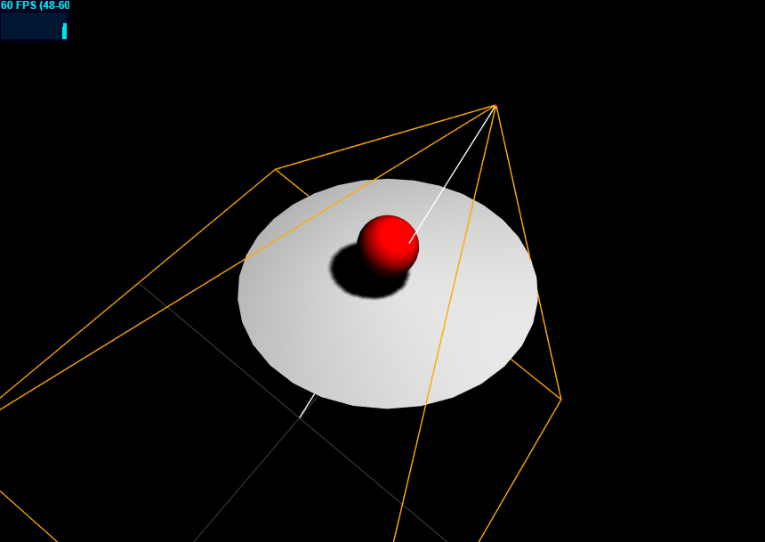

## ThreeJS 阴影

### 1. 产生阴影的条件

在 ThreeJS 中，设置阴影需要以下条件：

1. 告诉渲染器需要渲染阴影：

```js
renderer.shadowMap.enabled = true
```

2. 灯光开启阴影投射：

```js
const light = new THREE.SpotLight({ color: '#ddd' })
light.castShadow = true
```

3. 需要有物体接受投射的阴影：

```js
plan.receiveShadow = true
```

4. 对象需要产生阴影

```js
mesh.castShadow = true
```

以上为产生阴影的几大要素。

### 2. 详解

在 ThreeJS 中，能产生阴影的光源只有 **DirectionalLight(平行光)**和**SpotLight(聚光灯)**;能投射阴影的材质只有**MeshLambertMaterial**和**MeshPhongMaterial**这 2 种，其他的材质和灯光无法产生阴影

在开发过程中可以通过 CameraHelper 来查看光线的投射方向以及范围

```js
const helper = new THREE.CameraHelper(light.shadow.camera)
scene.add(helper)
```

参考文档：
[three.js 笔记 3--添加光源](https://godbasin.github.io/2017/04/22/three-notes-3-add-light-source/)

### 效果：


