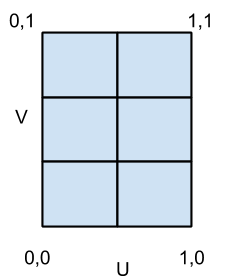
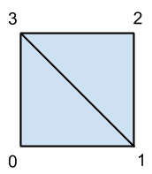

### ThreeJS(3): 纹理贴图

只看各种颜色的模型难免有些无聊，要想真正的展示 3D 世界，我们还需要贴图，使模型生动，真实起来。

1. 单面贴图

我们可以引入一张图片贴在立方体的各个平面上，在 ThreeJS 中，贴图的图片尺寸应该为 2 的次方大小。加载图片我们可以使用以下方法：

```js
const textureLoader = new THREE.TextureLoader()
const texture = textureLoader.load(imgPath)
```

textureLoader.load 返回一个新的纹理对象，该纹理对象可以直接用于材质创建，同时它的参数也支持 onLoad,onProgress 等方法，可以在等待图片加载的过程中进行处理，详情见[官方文档](https://threejs.org/docs/index.html#api/zh/loaders/TextureLoader.load)

加载完纹理后我们可以使用纹理，将材质的 map 设置为纹理对象即可：

```js
const material = new THREE.MeshBasicMaterial({ map: texture })
```

2. 多面贴图

我们可以针对对象的不同的面，贴上不同的纹理，这里有多种方法可以处理，我们可以给 Mesh 对象的 material 传递一个数组，这样会给不同的面映射不同的材质贴图，如下：

```js
const box = new THREE.BoxGeometry(20, 20, 20)
const imgList = [
  './images/bricks.jpg',
  './images/clouds.jpg',
  './images/crate.jpg',
  './images/stone-wall.jpg',
  './images/water.jpg',
  './images/wood-floor.jpg'
]
const materials = imgList.map(imgPath => {
  const texture = textureLoader.load(imgPath)
  return new THREE.MeshBasicMaterial({ map: texture })
})

const mesh = new THREE.Mesh(box, materials)
```

另外，Three 提供了 CubeTexture 更加方便了我们给立方体贴图，如下：

```js
var loader = new THREE.CubeTextureLoader()
loader.setPath('textures/cube/pisa/')

var textureCube = loader.load(['px.png', 'nx.png', 'py.png', 'ny.png', 'pz.png', 'nz.png'])

var material = new THREE.MeshBasicMaterial({ color: 0xffffff, envMap: textureCube })
```

3. UV 贴图
   其本质上就是把平面图像的不同区块映射到 3D 模型的不同面上去，UV 贴图处理起来比较麻烦，一般的模型是通过建模软件建立好模型然后倒入进行处理的。
   例如，我们把上面立方体用到的 6 张图合并为一张图：


首先我们加载这张图片并设置纹理：

```js
const texture = textureLoader.load('./images/texture-atlas.jpg')
const m = new THREE.MeshBasicMaterial({ map: texture })
```

然后，我们需要创建贴图的 6 个子贴图，告诉每个面使用贴图的坐标，坐标的范围值是 0 到 1，(0,0)表示左下角，(1,1)表示右上角

```js
/**
 *  4<----3
 *  |     |
 *  1---->2
 */
const bricks = [
  new THREE.Vector2(0, 0.666),
  new THREE.Vector2(0.5, 0.666),
  new THREE.Vector2(0.5, 1),
  new THREE.Vector2(0, 1)
]
const clouds = [
  new THREE.Vector2(0.5, 0.666),
  new THREE.Vector2(1, 0.666),
  new THREE.Vector2(1, 1),
  new THREE.Vector2(0.5, 1)
]
const crate = [
  new THREE.Vector2(0, 0.333),
  new THREE.Vector2(0.5, 0.333),
  new THREE.Vector2(0.5, 0.666),
  new THREE.Vector2(0, 0.666)
]
const stone = [
  new THREE.Vector2(0.5, 0.333),
  new THREE.Vector2(1, 0.333),
  new THREE.Vector2(1, 0.666),
  new THREE.Vector2(0.5, 0.666)
]
const water = [
  new THREE.Vector2(0, 0),
  new THREE.Vector2(0.5, 0),
  new THREE.Vector2(0.5, 0.333),
  new THREE.Vector2(0, 0.333)
]
const wood = [
  new THREE.Vector2(0.5, 0),
  new THREE.Vector2(1, 0),
  new THREE.Vector2(1, 0.333),
  new THREE.Vector2(0.5, 0.333)
]
```

贴图坐标系示意如下：


子图像的坐标是根据贴图中百分比来定义,例如，water 图片的坐标可以这样：

```js
const water = [
  new THREE.Vector2(0, 0),
  new THREE.Vector2(0.5, 0),
  new THREE.Vector2(0.5, 0.333),
  new THREE.Vector2(0, 0.333)
]
```

定义好子图像后，我们现在需要把它们映射到立方体的各个面上去。首先添加如下代码:

```js
box.faceVertexUvs[0] = []
```

上述代码清除现有的 UV 映射，接着我们添加如下代码:

```js
box.faceVertexUvs[0][0] = [bricks[0], bricks[1], bricks[3]]
box.faceVertexUvs[0][1] = [bricks[1], bricks[2], bricks[3]]

box.faceVertexUvs[0][2] = [clouds[0], clouds[1], clouds[3]]
box.faceVertexUvs[0][3] = [clouds[1], clouds[2], clouds[3]]

box.faceVertexUvs[0][4] = [crate[0], crate[1], crate[3]]
box.faceVertexUvs[0][5] = [crate[1], crate[2], crate[3]]

box.faceVertexUvs[0][6] = [stone[0], stone[1], stone[3]]
box.faceVertexUvs[0][7] = [stone[1], stone[2], stone[3]]

box.faceVertexUvs[0][8] = [water[0], water[1], water[3]]
box.faceVertexUvs[0][9] = [water[1], water[2], water[3]]

box.faceVertexUvs[0][10] = [wood[0], wood[1], wood[3]]
box.faceVertexUvs[0][11] = [wood[1], wood[2], wood[3]]
```

box 对象的 faceVertexUvs 属性包含该 box 各个面的坐标映射。既然我们映射到一个多维数据集，你可能会疑惑为什么数组中有 12 个面。原因是在 ThreeJS 模型中，立方体的每个面实际上是由 2 个三角形组成的。所以我们必须单独映射每个三角形。上述场景中，ThreeJS 将为我们加载单一材料贴图，自动分拆成三角形并映射到每个面

这里要注意每个面的顶点坐标的定义顺序必须遵循逆时针方向。为了映射底部三角形，我们需要使用的顶点指数 0，1 和 3，而要映射顶部三角形，我们需要使用索引 1，2，和顶点的 3。



最后，应用纹理：

```js
const mesh = new THREE.Mesh(box, m)
```

3. 视频贴图

静止的图片
